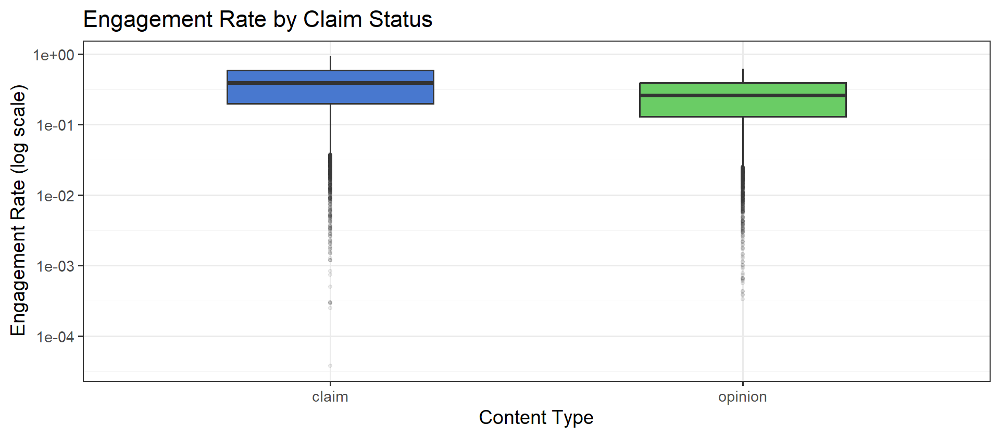
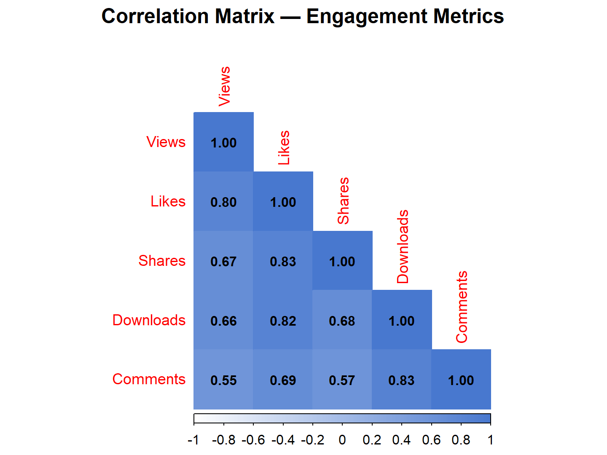
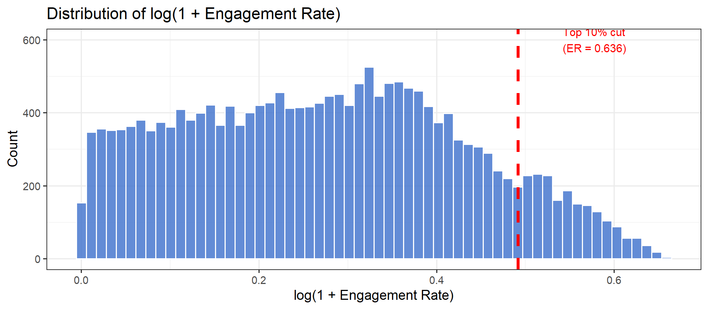

# TikTok Virality: Data Cleaning & Feasibility Analysis

Can we tell in advance which short-form videos will take off? This project builds the data foundation for answering that: a reproducible cleaning pipeline, a workable definition of "viral", and the exploratory evidence needed to decide whether a prediction model is worth building.

**Stack:** R (tidyverse, ggplot2, corrplot, R Markdown) · Python (HuggingFace `datasets`)

> **Scope.** This is a feasibility study. It covers data cleaning, label design and EDA, plus the design of a modelling pipeline. No model is trained or evaluated here.

---

## Problem

Short-form platforms publish enormous volumes of content, but only a small slice reaches a large audience. Three groups act on that question differently:

| Stakeholder | Decision |
|---|---|
| Content creators | What format and posting strategy to use |
| Brands | Which creators to put influencer budget behind |
| Multi-channel networks | Which creators to recruit early |

Raw view count is a poor target for all three, because it mostly reflects how big an account already is. This project instead defines virality as the **top 10% of engagement rate** — `(likes + comments + shares) / views` — which is independent of audience size.

## Data

| Source | Scale | Role |
|---|---|---|
| [Kaggle TikTok dataset](https://www.kaggle.com/datasets/raminhuseyn/dataset-from-tiktok/data) | 19,382 rows × 12 cols | Demonstration dataset used throughout the main analysis |
| [HuggingFace TikTok-10M](https://huggingface.co/datasets/The-data-company/TikTok-10M) | 9.78 GB Parquet, 55 cols | Full-scale source; pipeline designed for it in the appendix |

Python is used purely as an acquisition utility — streaming the Parquet shards and writing a year-filtered CSV — because R has no efficient native streamer for them. **All cleaning, feature engineering and analysis is done in R.**

## Approach

The cleaning pipeline is organised around DAMA data-quality dimensions, so each step answers a named quality question rather than being an ad-hoc fix:

| Step | Dimension | Result |
|---|---|---|
| Drop rows missing core engagement metrics | Completeness | 298 rows removed (1.54%) |
| Remove zero-view records | Validity | 0 removed |
| 3×IQR fence on view count | Reasonability | 0 outliers |
| Deduplicate on video ID | Uniqueness | 0 duplicates |
| Engagement rate, viral label, duration bins | Integrity | 19,084 rows retained |

The 298 missing rows are missing across **all seven** engagement columns at once rather than scattered at random, which points to records not yet indexed at collection time — so they are dropped as a block instead of imputed.

The top-10% cut-point lands at an engagement rate of **0.636**, giving a clean ~10:1 class imbalance.

## Findings

**Content type is a real signal.** Claim videos have a median engagement rate of 0.394 versus 0.259 for opinion videos — about 52% higher, with a t-test p < 0.001.



**Duration is not.** Median engagement varies only about 3% across the four duration bins. A single-feature heuristic like "keep it under 15 seconds" is not supported by this data, which is the central argument for combining content, creator and contextual features.

**Author status matters.** Banned (0.396) and under-review (0.351) authors show higher median engagement than active ones (0.305) — a controversial-content effect any model would need to account for.

**Engagement counts are heavily collinear** (likes–views r = 0.80, shares–views r = 0.67), so tree-based methods are preferable to linear ones.



The engagement-rate distribution is strongly right-skewed, which is why the log transform is used and why the top-10% threshold is a cut on the tail rather than a natural break:



## Proposed Model (design only)

Logistic Regression as a baseline → Random Forest → XGBoost with `scale_pos_weight` for the imbalance, interpreted with SHAP. Planned metrics: precision, recall, F1, ROC-AUC. Scaling to TikTok-10M adds the feature classes the demo dataset lacks entirely — music/audio, posting time and geolocation.

## Repository

```
analysis/tiktok_virality_feasibility.Rmd   cleaning, labelling, EDA, and the TikTok-10M pipeline appendix
scripts/sample_tiktok10m_filtered.py       streams TikTok-10M and writes a year-filtered CSV
scripts/probe_year_distribution.py         checks the year distribution before sampling
figures/                                   figures used above
data/README.md                             download links
```

## Running It

```r
install.packages(c("tidyverse", "scales", "knitr", "corrplot", "rmarkdown"))
rmarkdown::render("analysis/tiktok_virality_feasibility.Rmd")
```

Download `tiktok_dataset.csv` from the Kaggle link above and place it beside the `.Rmd` first. The raw data is not committed, since it belongs to its original publishers.

## Context

Individual assignment for FIT5145 Foundations of Data Science, Monash University Malaysia, March–May 2026.
