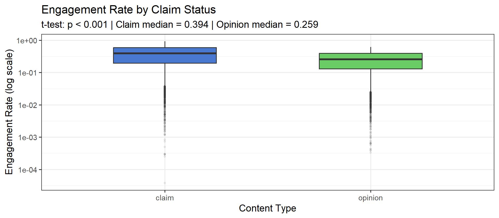
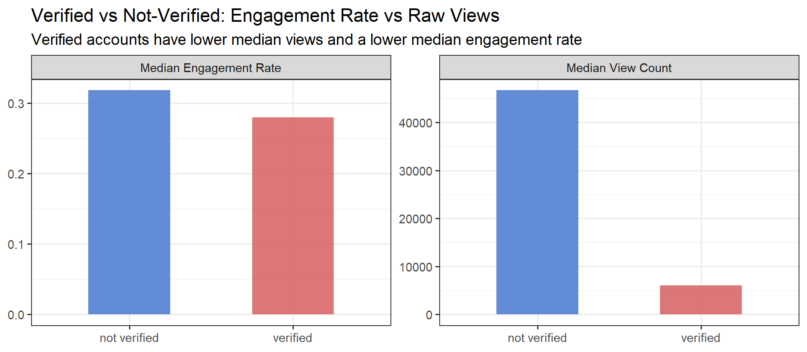
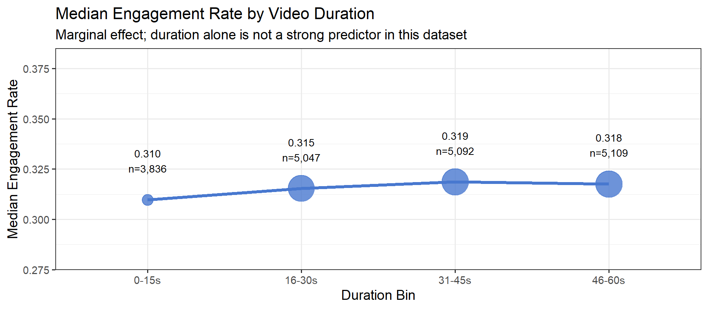

# TikTok Video Virality Prediction

> Feasibility study and proposed machine-learning framework for predicting which short-form videos go viral on TikTok. Data cleaning, virality labelling and exploratory analysis in R, framed around creator, brand and MCN decisions.

Individual project for *Foundations of Data Science* (FIT5145) at Monash University Malaysia, Mar-May 2026.

**Scope:** this repository contains the data work (cleaning, label definition, EDA) and the proposed modelling approach. The classification models described below are the *proposed* design; they have not been trained or evaluated.

## Business Problem

Short-form video platforms produce enormous content volumes, yet only a small fraction achieves viral reach. The project defines virality as the **top 10% of engagement rate**, (likes + comments + shares) / views, and asks whether it can be predicted early enough to support three decisions:

| Stakeholder | Decision supported |
|---|---|
| Content creators | Optimise posting strategy and content format for reach |
| Brands | Allocate influencer-marketing budgets to high-virality-potential creators |
| MCNs | Identify and recruit promising creators early |

## Data

| Source | Size | Role |
|---|---|---|
| [Kaggle TikTok engagement dataset](https://www.kaggle.com/datasets/raminhuseyn/dataset-from-tiktok/data) | 19,382 rows, 12 columns | Prototype dataset for cleaning and EDA |
| [HuggingFace TikTok-10M](https://huggingface.co/datasets/The-data-company/TikTok-10M) | 10M rows, 55 columns, 9.78 GB Parquet | Full-scale source with audio, geolocation, hashtag and posting-time fields; sampled to 100k rows via streaming |

## Cleaning and Labelling

- 298 rows (1.54%) were missing every engagement metric at once, which points to records not yet indexed at collection time rather than random gaps, so they were dropped as a block (19,084 rows retained).
- No zero-view rows, no outliers under a 3x IQR fence, and no duplicate video IDs were found.
- Engagement rate replaces raw view count as the target, because it does not depend on audience size.
- The top-10% cut-point is an engagement rate of 0.636, giving roughly a 10:1 class imbalance.

## Key Findings (EDA)

**1. Claim videos engage more than opinion videos.** Median engagement rate is 0.394 vs 0.259, about 52% higher (Welch t-test, p < 0.001).



**2. Verified accounts get fewer views and lower engagement.** Median views are 6,024 vs 46,723 and median engagement rate is 0.280 vs 0.318. The engagement gap is partly a content-mix effect: 83% of verified videos are opinion-type, which engage less.



**3. Duration alone is a weak predictor.** Median engagement rate varies by only 2.9% across duration bins, versus about 52% for claim status. This supports combining content, creator and contextual features.



**4. Engagement counts are strongly collinear** (likes vs views r = 0.80, shares vs views r = 0.67), which favours tree-based models over linear ones.

## Proposed Modelling Framework (not yet implemented)

Logistic Regression as a baseline, then Random Forest, then XGBoost with `scale_pos_weight` for the class imbalance, with SHAP for interpretation. Planned evaluation: precision, recall, F1 and ROC-AUC. TikTok-10M would add the music/audio, posting-time and geolocation features the demo dataset lacks.

## Repository Contents

```
analysis/tiktok_virality_feasibility.Rmd   cleaning, labelling and EDA (R Markdown)
scripts/sample_tiktok10m.py                streams a 100k-row sample from TikTok-10M
figures/                                   figures used in this README
data/README.md                             where to download the dataset
```

## Reproduce

1. Download `tiktok_dataset.csv` from the Kaggle link above and place it next to the `.Rmd` file.
2. In R, install `tidyverse`, `scales`, `knitr`, `corrplot` and `rmarkdown`, then knit `analysis/tiktok_virality_feasibility.Rmd`.

The raw data is not committed because it belongs to its original publishers.

## Tech Stack

| Tool | Purpose |
|---|---|
| R (tidyverse, ggplot2, corrplot, knitr) | Cleaning, feature engineering, EDA, reproducible report |
| Python (HuggingFace datasets) | Streaming a 100k-row sample from TikTok-10M |

## Author

Xiaowei Xu | Master of Data Science, Monash University Malaysia
